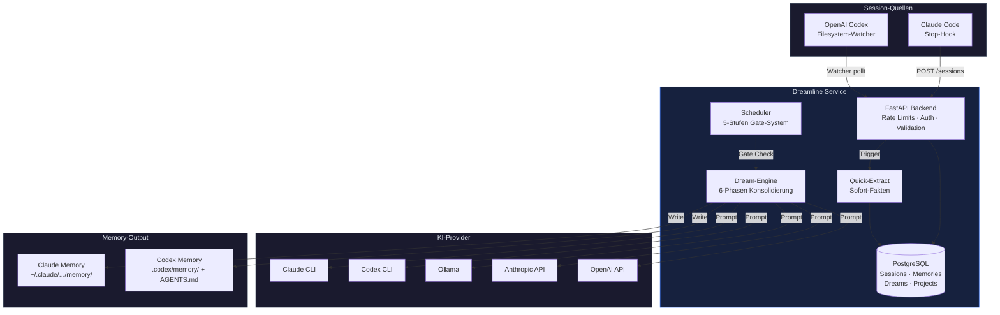

<p align="center">
  
</p>

<h1 align="center">Dreamline</h1>

<p align="center">
  <em>Self-Evolving AI Memory &mdash; Your agents remember everything.</em>
</p>

<p align="center">
  <a href="#schnellstart"></a>
  <a href="#ki-provider"></a>
  <a href="https://github.com/antonio-030/Dreamline-Claude/actions"></a>
</p>

<br>

> **Sessions rein, konsolidierte Memories raus.**
> Dreamline sammelt Chat-Sessions aus Claude Code und OpenAI Codex,
> konsolidiert Wissen per KI ("Dreaming"), und schreibt strukturierte
> Memory-Dateien zurueck ins Projekt. Beim naechsten Start hat dein
> KI-Agent sofort den vollen Kontext.

<br>

## Wie es funktioniert

```
                    ┌─────────────┐
  Claude Code ──────┤             ├──── ~/.claude/projects/*/memory/
                    │  Dreamline  │
  OpenAI Codex ─────┤   Dream    ├──── .codex/memory/ + AGENTS.md
                    │   Engine   │
  Ollama (lokal) ───┤             ├──── Dedupliziert & versioniert
                    └──────┬──────┘
                           │
                    PostgreSQL + Scheduler
                    (alles automatisch)
```

**Der Kreislauf:** Du arbeitest mit deinem KI-Agent &rarr; Sessions werden gesammelt &rarr; Dreamline "traeumt" (konsolidiert per LLM) &rarr; Memories erscheinen als Markdown im Projekt &rarr; dein Agent hat beim naechsten Start sofort den Kontext.

<br>

## Features

| | Feature | Details |
|---|---|---|
| 🌙 | **Dream-Engine** | 6-Phasen Konsolidierung mit Dual-Lock, automatisch per Scheduler |
| ⚡ | **Quick-Extract** | Sofortige Fakten-Extraktion nach jeder Session |
| 🔍 | **Smart Recall** | KI-gestuetzte Relevanzsuche ueber alle Memories |
| 🔄 | **Multi-Tool** | Claude Code (Hook) + OpenAI Codex (Watcher) gleichzeitig |
| 🤖 | **5 Provider** | Claude-Abo, Codex-Abo, Ollama, Anthropic API, OpenAI API |
| 📊 | **Dashboard** | Web-UI fuer Projekte, Dreams, Memories, Provider-Status |
| 🔒 | **Robust** | Rate Limits, Input-Validation, 162 Tests, CI-Pipeline |
| 📝 | **4 Memory-Typen** | user, feedback, project, reference (YAML-Frontmatter) |

<br>

## Schnellstart

```bash
# Klonen + starten
git clone https://github.com/antonio-030/Dreamline-Claude.git
cd Dreamline-Claude
cp .env.example .env        # DREAMLINE_SECRET_KEY aendern!
docker compose up -d

# Dashboard oeffnen → http://localhost:8100
# Setup-Wizard fuehrt durch: Admin-Key → Provider anmelden → Projekt verbinden
```

> **Das war's.** Dreamline installiert automatisch den Claude Code Hook,
> importiert vorhandene Sessions, und startet den Scheduler.
> Der erste Dream laeuft sobald genug Sessions da sind (Standard: 3).

<br>

## Architektur



<br>

## KI-Provider

| Provider | Auth | Kosten | Modell |
|---|---|---|---|
| **claude-abo** | Claude CLI Login | Bestehendes Abo | claude-sonnet-4-5 |
| **codex-sub** | Codex CLI Login | OpenAI Plus/Pro Abo | gpt-5.2-codex |
| **ollama** | Keine | Kostenlos (lokal) | z.B. llama3.2 |
| **anthropic** | API-Key | Pay-per-use | claude-sonnet-4-5 |
| **openai** | API-Key | Pay-per-use | gpt-4o |

> **Empfehlung:** `claude-abo` oder `codex-sub` nutzen das bestehende Abo ohne Zusatzkosten.
> Ollama ist komplett kostenlos und offline. Dream-Provider kann pro Projekt separat konfiguriert werden.

<br>

## API

Alle Endpoints unter `/api/v1/`. Auth per `Bearer`-Token (Projekt) oder `X-Admin-Key` (Admin).

<details>
<summary><strong>Kern-Endpoints</strong></summary>

| Methode | Endpoint | Beschreibung |
|---|---|---|
| `POST` | `/sessions` | Chat-Session aufzeichnen |
| `POST` | `/dreams` | Dream manuell ausloesen |
| `GET` | `/memories` | Alle Memories auflisten |
| `GET` | `/recall?query=...` | Relevante Memories suchen |
| `GET` | `/stats` | Aggregierte Statistiken |
| `GET` | `/dreams/status` | Aktueller Dream-Status |

</details>

<details>
<summary><strong>Projekt-Verwaltung (Admin)</strong></summary>

| Methode | Endpoint | Beschreibung |
|---|---|---|
| `POST` | `/projects` | Projekt erstellen |
| `GET` | `/projects` | Projekte auflisten |
| `PATCH` | `/projects/{id}` | Projekt bearbeiten |
| `DELETE` | `/projects/{id}` | Projekt loeschen |
| `GET` | `/projects/provider-status` | Provider-Health aller Projekte |

</details>

<details>
<summary><strong>Projekt-Verknuepfung</strong></summary>

| Methode | Endpoint | Beschreibung |
|---|---|---|
| `GET` | `/link/scan` | Lokale Claude-Projekte scannen |
| `GET` | `/link/scan-codex` | Lokale Codex-Projekte scannen |
| `POST` | `/link/quick-add` | One-Click Setup (Claude) |
| `POST` | `/link/quick-add-codex` | One-Click Setup (Codex) |
| `POST` | `/link/import-sessions/{id}` | Sessions importieren |
| `POST` | `/link/sync/{id}` | Memories ins Projekt schreiben |

</details>

<br>

## Konfiguration

<details>
<summary><strong>Umgebungsvariablen (.env)</strong></summary>

| Variable | Default | Beschreibung |
|---|---|---|
| `DREAMLINE_SECRET_KEY` | `change-me-...` | Admin-Key (Dashboard + API) |
| `DEFAULT_AI_PROVIDER` | `claude-abo` | Standard Dream-Provider |
| `AUTODREAM_ENABLED` | `true` | Automatische Dreams |
| `AUTODREAM_MIN_HOURS` | `12` | Mindestabstand zwischen Dreams |
| `AUTODREAM_MIN_SESSIONS` | `3` | Mindestanzahl Sessions fuer Dream |
| `CODEX_WATCHER_ENABLED` | `false` | Codex-Watcher aktivieren |
| `ANTHROPIC_API_KEY` | — | Nur fuer `anthropic`-Provider |
| `OPENAI_API_KEY` | — | Nur fuer `openai`-Provider |
| `OLLAMA_BASE_URL` | `host.docker.internal:11434` | Ollama-Server |

</details>

<br>

## Memory-Format

Dreamline schreibt Memories als Markdown mit YAML-Frontmatter:

```markdown
---
name: deployment-workflow
description: Standard-Deployment-Prozess
type: reference
confidence: 0.95
---

Deployment erfolgt via docker compose auf dem Produktionsserver.
```

**4 Typen:** `user` (ueber dich) · `feedback` (was funktioniert) · `project` (Projekt-Fakten) · `reference` (externe Links)

**2 Ausgabe-Orte:** Claude (`~/.claude/.../memory/MEMORY.md`) · Codex (`.codex/memory/AGENTS.md`)

<br>

## Entwicklung

```bash
# Tests (im Container)
docker exec dreamline-claude-dreamline-1 python -m pytest tests/ -q

# Logs
docker logs dreamline-claude-dreamline-1 --tail 50

# Rebuild
docker compose up -d --build dreamline
```

**162 Tests** · **CI-Pipeline** (lint + tests + migration check + docker build) · **Rate Limits** auf allen 32 Endpoints

<br>

---

<p align="center">
  <sub>Built with FastAPI · SQLAlchemy · PostgreSQL · Docker</sub><br>
  <sub>Made for developers who want their AI agents to remember.</sub>
</p>
